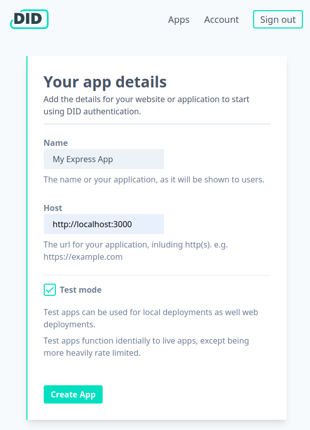

Just want the code? Find this example on [github](https://github.com/did-app/did-nodejs/tree/master/examples/myapp)

### Requirements

This tutorial will require you to have Node.js and Express installed.

- [Express install guide](https://expressjs.com/en/starter/installing.html)
- [Node.js install guide](https://nodejs.org/en/)

### New Express project

Use the [Express generator](https://expressjs.com/en/starter/generator.html) to start a new project.

```bash
npx express-generator --view=pug myapp
cd myapp
npm install
```

Install `openid-client` and `cookie-session` from npm.

```bash
npm install --save openid-client cookie-session
```

### Add sessions to the application

We will use [cookie-session](https://www.npmjs.com/package/cookie-session) so that we can keep a user signed in after we have authenticated them.
To use it, require the module and add to the apps middleware in `app.js`.

```js
// other dependencies
var cookieSession = require("cookie-session");

// other middleware
var { SESSION_SECRET } = process.env;
app.use(cookieSession({ name: "myapp", secret: SESSION_SECRET }));
```

It is best practise to keep your session secret out of your source code.

### Fetch OpenID Connect configuration

Only routes for handing authentication will require the OpenID Configuration for DID.app.
Create a routes file for sessions `routes/session.js` and configure the client library.

```js
var express = require("express");
var router = express.Router();
var { Issuer } = require("openid-client");

var { CLIENT_ID, CLIENT_SECRET } = process.env;

var clientPromise = Issuer.discover("https://did.app").then(function(issuer) {
  console.log("Discovered issuer %s %O", issuer.issuer, issuer.metadata);
  return new issuer.Client({
    client_id: CLIENT_ID,
    client_secret: CLIENT_SECRET
  });
});

// ...
```

The `client_id` in `client_secret` are fetched from the environment,
we will generate them later.

### Create File for sign in routes

Signing in, or up, using the OpenID connect flow requires two endpoints.

One endpoint redirects the user to the OpenID provider (in this case DID.app) to authenticate themselves.
A second callback endpoint is where the result of authenticating is handled.

Add both of these into the session routes file.

```js
// ...

router.get("/authenticate", function(req, res, next) {
  clientPromise.then(function(client) {
    var authorizationUrl = client.authorizationUrl({
      scope: "openid",
      redirect_uri: "http://localhost:3000/session/callback"
    });
    res.redirect(authorizationUrl);
  });
});

router.get("/callback", function(req, res, next) {
  clientPromise
    .then(function(client) {
      var params = client.callbackParams(req);
      return client.callback("http://localhost:3000/session/callback", params);
    })
    .then(function(tokenSet) {
      var claims = tokenSet.claims();
      console.log(claims);
      req.session = { userId: claims.sub };
      res.redirect("/");
    });
});

module.exports = router;
```

Add the session routes to the express app in `app.js`.

```js
// other dependencies
var sessionRouter = require("./routes/session");

// ...

app.use("/", indexRouter);
app.use("/users", usersRouter);
// new routes
app.use("/session", sessionRouter);
```

### Display authentication status

Our users need a button that lets them sign in.
To add one to the homepage the route handler checks if there is already a user session,
if so we make this user id available to the view.
Make these changes to `routes/index.js`

```js
router.get("/", function(req, res, next) {
  var session = req.session || {};
  res.render("index", { title: "Express", userId: session.userId });
});
```

In the view we use the user id to show them some information about them, or if no user a sign in button this code to show a button
Add this snippet into `views/index.pug`.

```pug
if userId
  span User ID #{userId}
else
  a.button.action(href='/session/authenticate') Sign in
```

### Setup the App on DID

You will need a DID account. [Sign up]({{ site.auth_origin }}) to create one now.

After signing up, you will be directed to set up your first app.
_Because we will run on localhost we need to use test app, select test mode._



After setting the details for the app, copy the client id and secret for use in our application.

### Try it out

Start Express, passing in the required configuration as environment variables.

```bash
CLIENT_ID=test_abc CLIENT_SECRET=test_abcdef SESSION_SECRET=somesecret npm start
```

Visit [localhost:3000](http://localhost:3000/),
you should see your new Express app with a shiny sign in button.

Any problems, see [this commit](https://github.com/did-app/did-nodejs/commit/e1bda6971b5e4b3b19655c8f915860107cbdc061) for the complete set of changes.

### Have a question?

If you have any further questions contact us at [team@did.app](mailto:team@did.app?subject=DID-Nodejs%20question).
