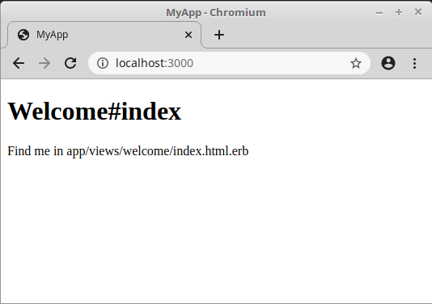
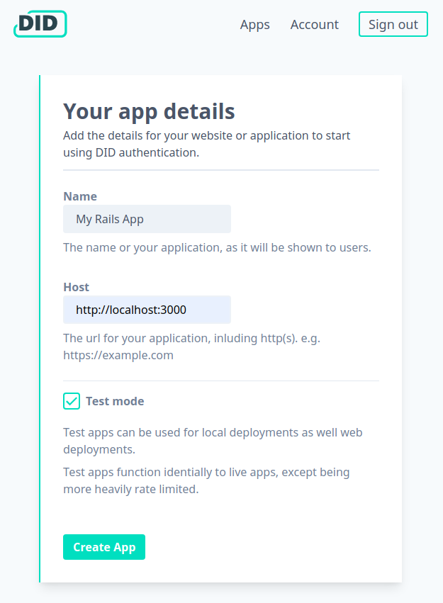

Just want the code? see [this commit](https://github.com/did-app/did-ruby/commit/73a975810e53efc9d4b54bdb8d504be51d7e0b13) for the complete set of changes.

### Requirements

The [Ruby on Rails install guide](https://guides.rubyonrails.org/getting_started.html#installing-rails) can help you install Rails and required dependencies.

### New Rails project

Start a new Rails project.

```bash
rails new my_app --skip-active-record --skip-javascript
cd my_app
```

_`--skip-active-record --skip-javascript` We don't need a database or JS bundle for this example_


Add Faraday to your `Gemfile` then run `bundle install`.

```ruby
gem 'faraday', '~> 1.0', '>= 1.0.1'
```

*For this guide we will use [Faraday](https://rubygems.org/gems/faraday) to make HTTP requests.
However you can replace this with your preferred client library.*

To finish setting up our new Rails project we will create a welcome page, using the Rails generator.

```
bin/rails generate controller Welcome index
```

Update the `routes.rb` so our new welcome page is set as the homepage for our new app.

```rb
Rails.application.routes.draw do
  get 'welcome/index'
  root 'welcome#index'
end
```

You should now have a working Rails application.
Start it with the following command:

```sh
./bin/rails server
```

Visit [http://localhost:3000](http://localhost:3000) and check you see the new homepage.



### Outline of Authentication Flow

Authenticating end users takes two steps.

1. Redirect a user to DID.app with an authentication request from your application.
2. Fetch user information associated with the code returned in the authentication response.

### Redirect user to authenticate with DID.app

Start the authentication process by redirecting a user to the authorization endpoint.
The redirect must include the authentication request parameters.

```erb
<form action="https://auth.did.app/oidc/authorize" method="get">
  <input name="client_id" value="<%= ENV["CLIENT_ID"] %>" type="hidden" />
  <input name="redirect_uri" value="<%= callback_url %>" type="hidden" />

  <button type="submit">Sign in</button>
</form>
```

The `CLIENT_ID` is a value provided to you by DID.app that we will generate later.  
The `callback_url` refers to a controller action that we will implement in the next section.

### Create a session controller to handle authentication callback

Once a user has authenticated, with DID.app, they will be redirected to the url that was specified in the authentication request.
We need to create a route to handle this.

First add the route into `routes.rb`.

```rb
Rails.application.routes.draw do
  # Other routes
  # ...

  get '/session/callback', to: 'session#callback', as: 'callback'
end
```

Create a new file for a session controller.
Add the following code to implement the callback route:

```rb
require 'faraday'
require 'json'

class SessionController < ApplicationController
  def callback
    response = Faraday.post(
      "https://auth.did.app/oidc/token",
      client_id: ENV["CLIENT_ID"],
      client_secret: ENV["CLIENT_SECRET"],
      code: params["code"]
    )
    data = JSON.parse(response.body)

    session[:current_user_id] = data["userinfo"]["sub"]
    redirect_to root_path
  end
end
```

The redirect url back to your app will include a query parameter containing a one-time code.
To finish authenticating a user, this code needs to be exchanged for a token and user information.

From this user information we extract the `sub` parameter which is short for `subject`. This parameter is a stable identifier for the user.
A verified email address is also returned as part of the user information.

This request will require your `CLIENT_ID` and `CLIENT_SECRET`.
It is good practice to keep these values out of your source code so we are using environment variables to configure them.

### Display Sign Out Button to Authenticated User

Once a user has authenticated, we no longer want to show them a sign in button.
Probably the most helpful thing to show instead would be a sign out button.

```erb
<% if session[:current_user_id] %>
  <%= link_to 'Sign out', sign_out_path %>
<% else %>
  <!-- Sign in form from earlier -->
<% end %>
```

<!-- Edit the template in `lib/my_notes_web/templates/layout/app.html.eex` with the new code. -->
### Create Sign Out Action

First add a sign out route to `routes.rb`, this action can also exist in our session controller.

```rb
Rails.application.routes.draw do
  # Other routes
  # ...

  get '/session/terminate', to: 'session#terminate', as: 'sign_out'
end
```

In the session controller add the route to sign out a user.

```rb
class SessionController < ApplicationController
  # callback action
  # ...

  def terminate
    reset_session
    redirect_to root_path
  end
end
```

Signing out a user is done by clearing the session information.

### Get App Identifiers DID.app

The final step is to get a `CLIENT_ID` and `CLIENT_SECRET` for you app.
You will need an account, [Sign up]({{ site.auth_origin }}/sign_up) to create one.

After signing up, you will be directed to set up your first app.
_Because we will run on localhost we need to use test app, select test mode._



After setting the details for the app, copy the client id and secret for use in our application.

### Try it out

Start Rails, passing in the required configuration as environment variables.

```bash
CLIENT_ID=test_abc CLIENT_SECRET=test_abcdef ./bin/rails server
```

Visit [localhost:3000](http://localhost:3000/),
you should see your new Rails app with a shiny sign in button.

Any problems, see [this commit](https://github.com/did-app/did-ruby/commit/73a975810e53efc9d4b54bdb8d504be51d7e0b13) for the complete set of changes.

### Have a question?

If you have any further questions contact us at [team@did.app](mailto:team@did.app?subject=DID-ruby%20question).
